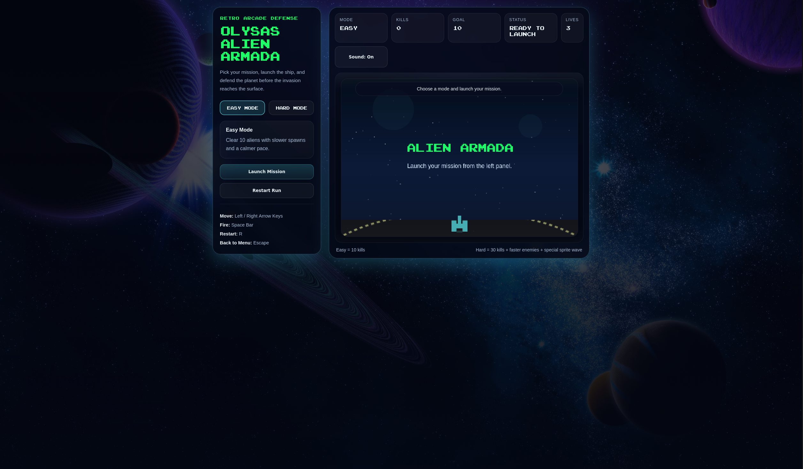

# 👾 Alien Armada

### Fight through enemy waves, survive the invasion, and push for a higher score.

  

---

## Overview

Alien Armada is a browser-based arcade space shooter built with HTML, CSS, and JavaScript.

This project is an upgraded version of my original school game, redesigned with improved gameplay flow, cleaner presentation, and a stronger arcade feel.

## Features

- Fast-paced arcade gameplay
- Wave-based enemy spawning
- Collision detection and score tracking
- Improved interface and gameplay flow
- Ongoing upgrades for polish and replayability

## Tech Stack

- HTML
- CSS
- JavaScript

## Development Focus

Alien Armada is being refined into a stronger and more polished browser game project, with current work focused on gameplay improvements, cleaner presentation, and better overall feel.
